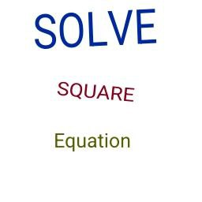

To see documentation:
1. Go to [main page](https://github.com/Matvey787/SolveEquation)
2. Download project in [.zip file](https://github.com/Matvey787/SolveEquation/archive/refs/heads/main.zip)
3. Do unzip downloaded file
4. Go to SolveEquation -> cpp_files -> doc
5. Open [index.html](https://github.com/Matvey787/SolveEquation/blob/main/cpp_files/doc/html/index.html)

### Built With

Programs that I used during the implementation of the solution of the quadratic equation.

(<a href="#readme-top">back to top</a>)

